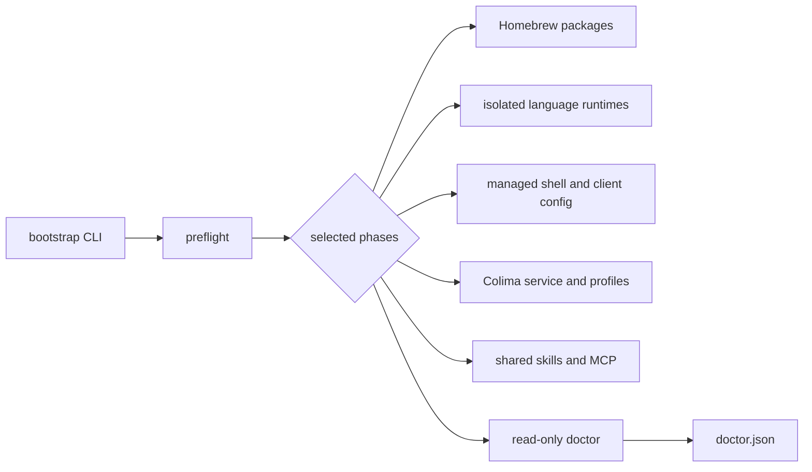
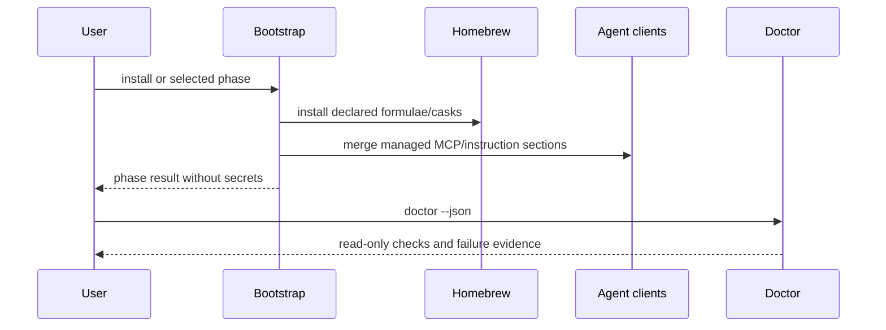

# Architecture

This repository is a single, local macOS bootstrap orchestrator. It is not an
MSA: there is no independent service boundary, database, or remote application
to deploy. Splitting these shell phases into services would add state and
credentials without an operational boundary to protect.

## Execution flow

## Boundaries

- `bootstrap` parses commands and selects phases.
- `lib/*.sh` owns one phase each and writes only managed blocks or state files.
- `config/` contains non-secret catalogs and templates.
- `scripts/` contains standard-library Python helpers for catalog/config merging.
- `tests/` uses temporary HOME fixtures; no test installs packages on the host.
- `docs/standards.md` records evidence and explicitly avoids certification claims.

Colima's service registration and active runtime are separate evidence points:
`brew services list` proves launchd registration, while `colima status --json`
must report `runtime: containerd` for the `nerdctl` contract. Existing profiles
are never deleted or recreated automatically.
