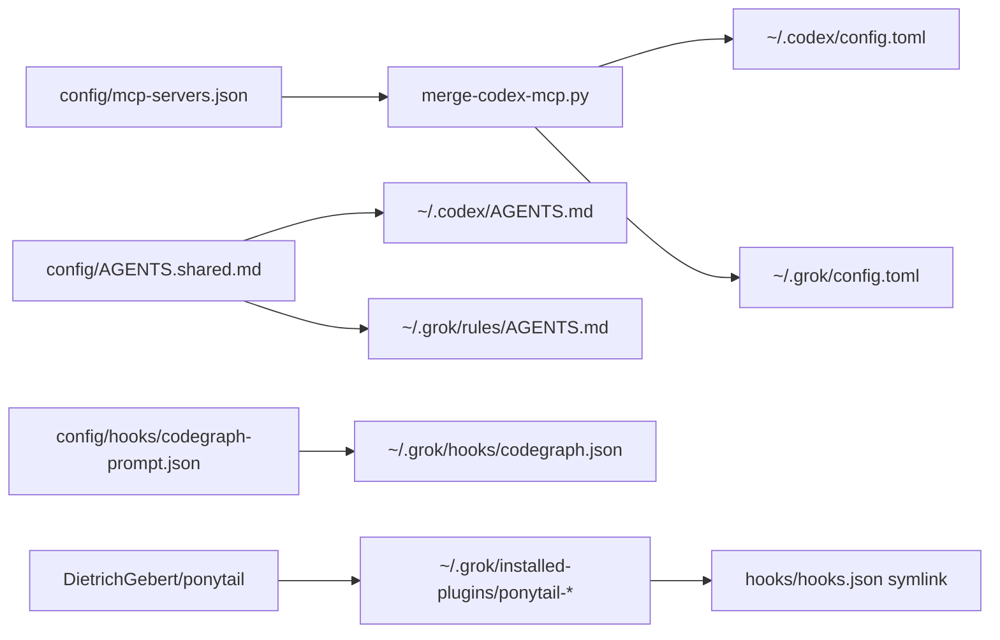

# Product and technical gap baseline

Living baseline derived from protected `develop`, open PRs, ADRs, and
operator-visible doctor evidence. Update this file when a PR lands or a
gap is repaired. Do not treat a GitHub “closed” label as completion.

## Goal and loop

- **Goal:** a Mac that already has Codex/Claude-quality MCP, instructions,
  hooks, plugins, and doctor evidence also has that contract for Grok Build,
  without inventing a second catalog.
- **Loop:** review open PRs → repair findings on the owner stack → re-run
  checks → merge only when required gates are green → start the next gap.
  Review wait is not a blocker for encoding a verified successor delta.
- **KPI (self-set, 2026-09-07):** `grok_surface_coverage` 6/6 and
  `scripts/test` GREEN. Surfaces: agent-targets `grok-cli`, TOML MCP merge,
  `~/.grok/rules/AGENTS.md`, native CodeGraph hook, Ponytail
  `hooks/hooks.json`, doctor REQ-22 plus REQ-08/REQ-10 Grok evidence.

## Exact authority

| Item | Value |
| --- | --- |
| Protected target | `develop@2368ed62937abfabb159c23aa52b81dde58b3dbe` |
| Immediate security base | `feat/skill-blacklist@f5c7ce0d30a3dd28938b5bc64432f9123443a465` (PR #3 exact head) |
| Current candidate | `feature/grok-native-client@b7f6bafb9b1b9369f9f3a53c8f687b72f6b0dfc7` (PR #6 exact head before this evidence-only update) |
| Encoding PR | [#6](https://github.com/ContextualWisdomLab/macos_utility_packs/pull/6) |
| ADR | [ADR-0002](adr/ADR-0002-grok-native-client.md) Proposed |
| Product version | `0.1.0` development; not a release tag |

## Open PRs (do not simple-close)

| PR | Intent | Head | Mergeable | Finding |
| --- | --- | --- | --- | --- |
| [#3](https://github.com/ContextualWisdomLab/macos_utility_packs/pull/3) feat(skills) deny list | Security control for shared skills | `f5c7ce0d30a3dd28938b5bc64432f9123443a465` | Ready; mergeable | Focused fail-closed tests are repaired. Security `36854917769` and Semgrep `36854917755` are terminal success; CodeQL `36854917835` is scope-skipped. Current inline-thread query returns 0 unresolved threads, but qualifying approval is 0. Ready is review admission, not merge authority. |
| [#4](https://github.com/ContextualWisdomLab/macos_utility_packs/pull/4) docs public surface | Pages-ready docs home, Apache-2.0 grant, DeepWiki badge | `0b8075a2998057bed7714c1676594d60d80e7799` | Ready; mergeable | Current inline-thread query returns 0 unresolved threads. Security `36687529056`, Semgrep `36687528819`, and CodeQL `36687529091` concluded success/skipped because their scanner jobs were scope-skipped; the predecessor `CHANGES_REQUESTED` verdict remains and no current qualifying approval exists. |
| [#6](https://github.com/ContextualWisdomLab/macos_utility_packs/pull/6) Grok native client | First-class Grok Build bootstrap | `b7f6bafb9b1b9369f9f3a53c8f687b72f6b0dfc7` before this evidence-only update | Draft; mergeable | Correctly stacked on exact PR #3 head. Current inline-thread query returns 0 unresolved threads, but the exact head has no associated workflow runs and no qualifying approval; keep Draft until the parent integrates and fresh exact-head gates complete. |

## Current gaps

1. **Grok native client (this change).** Source repairs require verified
   Grok identity, propagate MCP merge failures, and pin Ponytail v4.10.0.
   Completion still requires exact-head gates, approval, and merge.
2. **Current security-evidence limits.** PR #3 Security completed success with
   Trivy and Scorecard executed, while dependency-review, OSV, and gitleaks were
   scope-skipped. PR #4's scanner jobs were all docs-scope skipped. PR #6 has
   no exact-head workflow run. Workflow-level success is not promoted into an
   unexecuted scanner verdict.
3. **CodeGraph installer has no Grok target.** Catalog TOML supplies the
   MCP server. Do not invent `--target=grok`.
4. **Ponytail plugin update may drop `hooks/hooks.json`.** Extensions
   recreate the relative symlink; a later `grok plugin update` without a
   bootstrap rerun is an operator gap.
5. **No repository-local hosted shell suite on PR heads.** Claims of test
   GREEN are local `scripts/test` plus this baseline, not a substitute for
   org CI.
6. **Issue [#5](https://github.com/ContextualWisdomLab/macos_utility_packs/issues/5) Claude community plugins.** Consumer-only admission receipts.
   Delivery order forbids implementation until PR #3 (or a full successor
   delta) is merged and Noema #545 / AppGuardrail #1099 have *released*
   immutable authority. Do not consume those owners' mutable PR heads, and
   do not install `anthropics/claude-plugins-community` wholesale.

## UML — Grok client boundary

## Actions

1. Keep #3 Ready for review but hold merge until qualifying approval and then-live required gates are satisfied.
2. Keep #6 Draft on exact #3 because Grok Ponytail wildcard installation
   consumes #3's fail-closed deny-list boundary; after #3 integrates,
   non-force reconcile and require fresh exact-head checks and approval.
3. Keep #4 Ready/open as an independent documentation sibling; Ready admits
   review but does not dismiss the predecessor `CHANGES_REQUESTED` verdict or
   convert scope-skipped scanner jobs into evidence.
4. Keep issue #5 open. Start discovery-only work only after PR #3 lands
   and the named owner releases exist. Zero activation entries must still
   perform zero marketplace/install calls.

## Citations

Homebrew. (2026). *grok-build cask*. https://formulae.brew.sh/cask/grok-build

xAI. (2026). *Grok Build user guide: configuration, MCP, hooks, plugins, project rules*.
