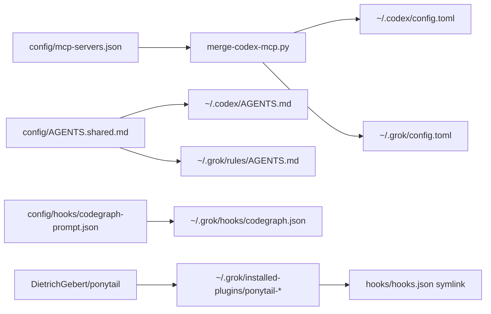

# Product and technical gap baseline

Living baseline derived from protected `develop`, open PRs, ADRs, and
operator-visible doctor evidence. Update this file when a PR lands or a
gap is repaired. Do not treat a GitHub “closed” label as completion.

## Goal and loop

- **Goal:** a Mac that already has Codex/Claude-quality MCP, instructions,
  hooks, plugins, and doctor evidence also has that contract for Grok Build,
  without inventing a second catalog.
- **Loop:** review open PRs → repair findings on the owner stack → re-run
  checks → merge only when required gates are green → start the next gap.
  Review wait is not a blocker for encoding a verified successor delta.
- **KPI (self-set, 2026-09-07):** `grok_surface_coverage` 6/6 and
  `scripts/test` GREEN. Surfaces: agent-targets `grok-cli`, TOML MCP merge,
  `~/.grok/rules/AGENTS.md`, native CodeGraph hook, Ponytail
  `hooks/hooks.json`, doctor REQ-22 plus REQ-08/REQ-10 Grok evidence.

## Exact authority

| Item | Value |
| --- | --- |
| Protected base | `develop@2368ed62937abfabb159c23aa52b81dde58b3dbe` |
| This encoding branch | `feature/grok-native-client` @ `8aa3224217cdce7e78882ed3ec43a7dac4582e26` |
| Encoding PR | [#6](https://github.com/ContextualWisdomLab/macos_utility_packs/pull/6) |
| ADR | [ADR-0002](adr/ADR-0002-grok-native-client.md) Proposed |
| Product version | `0.1.0` development; not a release tag |

## Open PRs (do not simple-close)

| PR | Intent | Head | Mergeable | Finding |
| --- | --- | --- | --- | --- |
| [#3](https://github.com/ContextualWisdomLab/macos_utility_packs/pull/3) feat(skills) deny list | Security control for shared skills | `d74f327b25e6ed56f0d41dda0db616891be4ef8c` | blocked | Source is a repair-complete security delta. Required Security Scan fails at Dependency Review HTTP 403 owned by `ContextualWisdomLab/.github#810`. Keep open; do not merge through admin bypass. |
| [#4](https://github.com/ContextualWisdomLab/macos_utility_packs/pull/4) docs public surface | Pages-ready docs home, Apache-2.0 grant, DeepWiki badge | `7477c5808827361f8e839f1cc1600b5416e31145` | blocked | Same central Dependency Review gate. Independent of Grok encoding. Keep open. |
| [#6](https://github.com/ContextualWisdomLab/macos_utility_packs/pull/6) Grok native client | First-class Grok Build bootstrap | `8aa3224217cdce7e78882ed3ec43a7dac4582e26` | checks in progress | Local `scripts/test` GREEN. Merge only after required gates. |

Local checkout of `feat/skill-blacklist` at `8348e4f` was behind origin
when this baseline was written; do not restack Grok work onto that stale
branch.

## Current gaps

1. **Grok native client (this change).** Closed in source on
   `feature/grok-native-client` once tests are green and the PR is merged
   to `develop`. Until merge, doctor on unmodified `develop` still omits
   Grok.
2. **Dependency Review 403.** Owner is `.github`, not this repository.
   Sibling OSV/Trivy/Scorecard GREEN does not substitute.
3. **CodeGraph installer has no Grok target.** Catalog TOML supplies the
   MCP server. Do not invent `--target=grok`.
4. **Ponytail plugin update may drop `hooks/hooks.json`.** Extensions
   recreate the relative symlink; a later `grok plugin update` without a
   bootstrap rerun is an operator gap.
5. **No repository-local hosted shell suite on PR heads.** Claims of test
   GREEN are local `scripts/test` plus this baseline, not a substitute for
   org CI.
6. **Issue [#5](https://github.com/ContextualWisdomLab/macos_utility_packs/issues/5) Claude community plugins.** Consumer-only admission receipts.
   Delivery order forbids implementation until PR #3 (or a full successor
   delta) is merged and Noema #545 / AppGuardrail #1099 have *released*
   immutable authority. Do not consume those owners' mutable PR heads, and
   do not install `anthropics/claude-plugins-community` wholesale.

## UML — Grok client boundary

## Actions

1. Land Grok encoding through normal protected review after local
   `scripts/test` GREEN.
2. Leave #3 and #4 open until `.github` Dependency Review is actually
   GREEN on those exact heads.
3. After Grok merge, restack #3/#4 only if they conflict; they currently
   do not own Grok adapter files.
4. Keep issue #5 open. Start discovery-only work only after PR #3 lands
   and the named owner releases exist. Zero activation entries must still
   perform zero marketplace/install calls.

## Citations

Homebrew. (2026). *grok-build cask*. https://formulae.brew.sh/cask/grok-build

xAI. (2026). *Grok Build user guide: configuration, MCP, hooks, plugins, project rules*.
