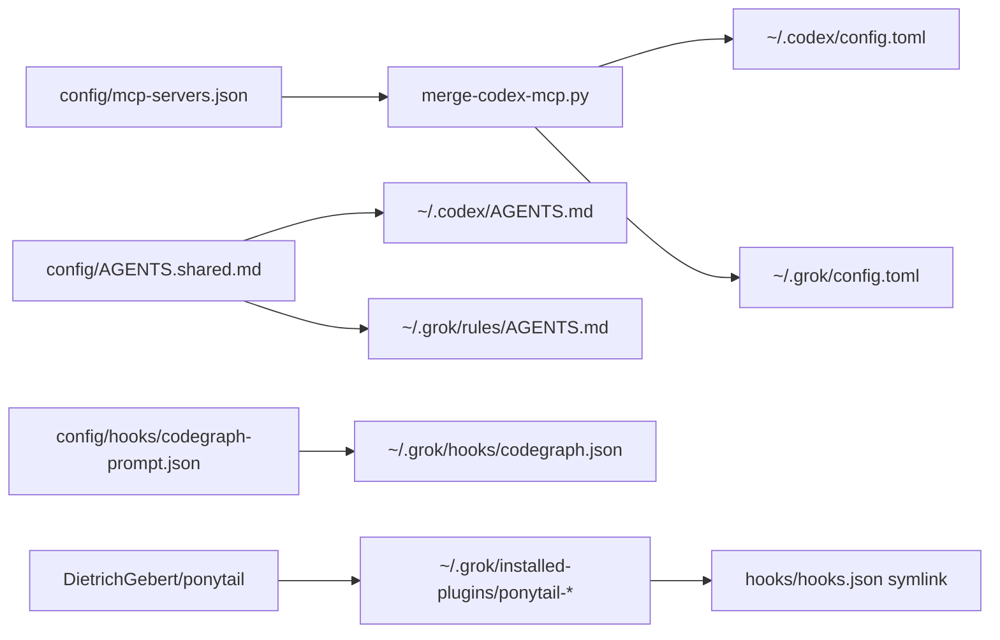

# Product and technical gap baseline

Living baseline derived from protected `develop`, open PRs, ADRs, and
operator-visible doctor evidence. Update this file when a PR lands or a
gap is repaired. Do not treat a GitHub “closed” label as completion.

## Goal and loop

- **Goal:** a Mac that already has Codex/Claude-quality MCP, instructions,
  hooks, plugins, and doctor evidence also has that contract for Grok Build,
  without inventing a second catalog.
- **Loop:** review open PRs → repair findings on the owner stack → re-run
  checks → merge only when required gates are green → start the next gap.
  Review wait is not a blocker for encoding a verified successor delta.
- **KPI (self-set, 2026-09-07):** `grok_surface_coverage` 6/6 and
  `scripts/test` GREEN. Surfaces: agent-targets `grok-cli`, TOML MCP merge,
  `~/.grok/rules/AGENTS.md`, native CodeGraph hook, Ponytail
  `hooks/hooks.json`, doctor REQ-22 plus REQ-08/REQ-10 Grok evidence.

## Exact authority

| Item | Value |
| --- | --- |
| Protected target | `develop@2368ed62937abfabb159c23aa52b81dde58b3dbe` |
| Immediate security base | `feat/skill-blacklist@97bd84eb5e6a43beb14533f3eaecc0725b58f117` |
| This repair parent | `feature/grok-native-client@9aac33b973301df765fb00313df7d7fd189744c0` |
| Encoding PR | [#6](https://github.com/ContextualWisdomLab/macos_utility_packs/pull/6) |
| ADR | [ADR-0002](adr/ADR-0002-grok-native-client.md) Proposed |
| Product version | `0.1.0` development; not a release tag |

## Open PRs (do not simple-close)

| PR | Intent | Head | Mergeable | Finding |
| --- | --- | --- | --- | --- |
| [#3](https://github.com/ContextualWisdomLab/macos_utility_packs/pull/3) feat(skills) deny list | Security control for shared skills | `97bd84eb5e6a43beb14533f3eaecc0725b58f117` | checks pending | Version and validator fail-open paths are repaired with 29 focused tests; exact-head central gates and approval must regenerate. Keep Draft and open. |
| [#4](https://github.com/ContextualWisdomLab/macos_utility_packs/pull/4) docs public surface | Pages-ready docs home, Apache-2.0 grant, DeepWiki badge | `0b8075a2998057bed7714c1676594d60d80e7799` | review pending | All inline threads are resolved; it remains an independent Draft without a qualifying approval. Keep open. |
| [#6](https://github.com/ContextualWisdomLab/macos_utility_packs/pull/6) Grok native client | First-class Grok Build bootstrap | repair parent `9aac33b973301df765fb00313df7d7fd189744c0` | repair in progress | RED cases reproduced the identity, error-propagation, and mutable-plugin defects. Stack on #3, then regenerate exact-head gates. |

## Current gaps

1. **Grok native client (this change).** Source repairs require verified
   Grok identity, propagate MCP merge failures, and pin Ponytail v4.10.0.
   Completion still requires exact-head gates, approval, and merge.
2. **Dependency Review 403.** Owner is `.github`, not this repository.
   Sibling OSV/Trivy/Scorecard GREEN does not substitute.
3. **CodeGraph installer has no Grok target.** Catalog TOML supplies the
   MCP server. Do not invent `--target=grok`.
4. **Ponytail plugin update may drop `hooks/hooks.json`.** Extensions
   recreate the relative symlink; a later `grok plugin update` without a
   bootstrap rerun is an operator gap.
5. **No repository-local hosted shell suite on PR heads.** Claims of test
   GREEN are local `scripts/test` plus this baseline, not a substitute for
   org CI.
6. **Issue [#5](https://github.com/ContextualWisdomLab/macos_utility_packs/issues/5) Claude community plugins.** Consumer-only admission receipts.
   Delivery order forbids implementation until PR #3 (or a full successor
   delta) is merged and Noema #545 / AppGuardrail #1099 have *released*
   immutable authority. Do not consume those owners' mutable PR heads, and
   do not install `anthropics/claude-plugins-community` wholesale.

## UML — Grok client boundary

## Actions

1. Keep #3 Draft until its exact-head central checks and approval are GREEN.
2. Non-force stack #6 on #3 because Grok Ponytail wildcard installation
   consumes #3's fail-closed deny-list boundary; validate the integrated tree.
3. Keep #4 open as an independent documentation sibling until approval.
4. Keep issue #5 open. Start discovery-only work only after PR #3 lands
   and the named owner releases exist. Zero activation entries must still
   perform zero marketplace/install calls.

## Citations

Homebrew. (2026). *grok-build cask*. https://formulae.brew.sh/cask/grok-build

xAI. (2026). *Grok Build user guide: configuration, MCP, hooks, plugins, project rules*.
